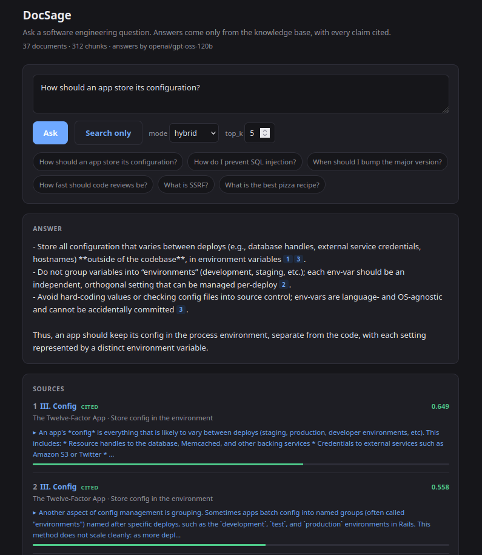
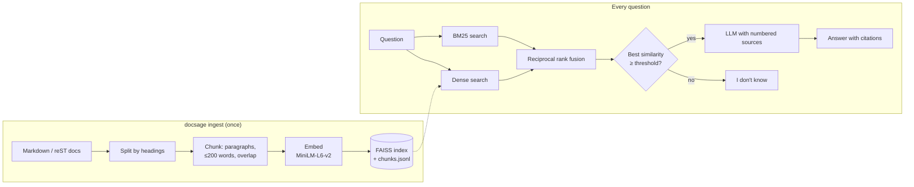

# DocSage

Retrieval-augmented question answering over a software engineering knowledge base, built from first principles in plain Python: no LangChain, no LlamaIndex.

Ask a question such as *"How should an app store its configuration?"* or *"How do I prevent SQL injection?"*. DocSage retrieves the relevant passages from 37 openly licensed engineering documents, answers only from them, and cites every claim. When the knowledge base doesn't cover a question, it says so instead of guessing.

[](https://github.com/ShalomHunukumbura/docsage/actions/workflows/ci.yml)

<p align="center">
  
</p>

## Highlights

- **Hybrid retrieval.** Dense embeddings (FAISS) and BM25 keyword search, merged with reciprocal rank fusion. Hybrid puts the right document first for 93% of questions, compared with 86% for either method alone.
- **Grounded answers with citations.** Answers cite numbered sources, and each citation links to the passage and the original document section.
- **Knows when to say "I don't know".** A similarity gate refuses off-topic questions before the LLM is called; the prompt handles near misses.
- **Measured, not guessed.** An evaluation set of 54 questions scores each retrieval mode, the refusal threshold and chunk size. The results are in [`eval/results.md`](eval/results.md).
- **Structure-aware chunking.** Documents are split along their own headings, and lists and code blocks are kept whole, so every chunk carries a path like `A03: Injection > How to Prevent`.
- **Runs anywhere.** The index is built once and saved to disk. The LLM is any OpenAI-compatible API, with Groq's free tier as the default. Ships with a Docker image, CI and 42 tests.

## How it works



| Stage | File | What it does |
| --- | --- | --- |
| Load | [`loader.py`](src/docsage/loader.py) | Parses Markdown and reStructuredText into sections with heading paths; drops tables, reference lists and markup noise |
| Chunk | [`chunker.py`](src/docsage/chunker.py) | Packs whole paragraphs up to 200 words with overlap, keeping lead-ins with their lists and folding tiny intro sections into the first subsection |
| Embed | [`embeddings.py`](src/docsage/embeddings.py) | `all-MiniLM-L6-v2`, normalised so inner product equals cosine similarity |
| Index | [`vector_store.py`](src/docsage/vector_store.py), [`bm25.py`](src/docsage/bm25.py), [`index.py`](src/docsage/index.py) | Exact FAISS index plus a small BM25 implementation; saved to disk by `docsage ingest` |
| Retrieve | [`retriever.py`](src/docsage/retriever.py) | Dense, keyword or hybrid (RRF) search |
| Generate | [`rag.py`](src/docsage/rag.py), [`llm.py`](src/docsage/llm.py) | Similarity gate, numbered-source prompt, citation parsing, LLM error handling |
| Serve | [`api.py`](src/docsage/api.py), [`cli.py`](src/docsage/cli.py) | FastAPI app, web UI and command-line interface |

## Evaluation

The evaluation set ([`eval/questions.jsonl`](eval/questions.jsonl)) has 42 questions the knowledge base can answer, each labelled with the document that answers it, and 12 it can't. The questions paraphrase the documents rather than quoting them, so keyword search gets no free wins.

**Retrieval** (a hit means a chunk from the right document is in the top k):

| Mode | Hit@1 | Hit@3 | Hit@5 | MRR |
| --- | --- | --- | --- | --- |
| Dense | 86% | 93% | 100% | 0.911 |
| Keyword (BM25) | 86% | 95% | 98% | 0.915 |
| **Hybrid (RRF)** | **93%** | **100%** | **100%** | **0.960** |

Dense and keyword search fail on different questions. Embeddings miss exact terms: "What should a process do when it receives SIGTERM?" ranks the right document 4th. BM25 misses paraphrases: "Should my app write and rotate its own log files?" also lands 4th, behind a document that happens to share more words. Fusion puts both in the top two, and hybrid has no question outside its top 3.

**Refusal threshold** (share of answerable questions let through, share of unanswerable questions stopped):

| Threshold | Answered | Refused |
| --- | --- | --- |
| 0.30 | 100% | 75% |
| **0.35 (default)** | **100%** | **83%** |
| 0.40 | 98% | 100% |
| 0.50 | 88% | 100% |

**Chunk size** made little difference on this corpus (MRR 0.966 at 100 words, 0.960 at 200, 0.964 at 300), so the default stays at 200 words, which gives the LLM more context per source.

Reproduce with `python eval/run_eval.py --sweep`.

## Design decisions

**Why the threshold is 0.35 and not 0.40.** On paper 0.40 scores better, but the questions it additionally refuses are near misses such as "How do I write a SQL window function?" (0.370) and "How do I set up a Python virtual environment?" (0.395). A real question, "Which algorithms should be used to hash stored passwords?", scores 0.375, right in the middle of them. No threshold separates these cleanly, and tuning one against 12 examples would be overfitting. So the gate has a narrower job: cheaply reject clearly off-topic questions (sports, recipes and geography score 0.10–0.21). Near misses go to the LLM, which is instructed to reply "I don't know" when the sources don't contain the answer. A wrong refusal costs more than one extra LLM call.

**Why no framework.** Every stage is a small file you can read top to bottom. BM25 is 50 lines, and rank fusion is 5. This keeps the behaviour inspectable, which matters when you are tuning retrieval rather than just calling it.

**Why FAISS on disk instead of a vector database.** The corpus is 312 chunks, so exact search takes microseconds and the whole index is under 1 MB. A database would add a moving part without improving anything measurable. The `VectorStore` interface is small enough to swap for pgvector if the corpus grows.

**Why embed the heading path with the text.** A chunk like "Use a safe API... parameterized queries" does not always say *injection*. Prefixing `A03: Injection > How to Prevent` gives both dense and keyword search the context the text itself leaves out.

## Getting started

Requires Python 3.12+ and [uv](https://docs.astral.sh/uv/).

```bash
uv sync                       # install
uv run docsage fetch          # download the 37 documents into data/corpus
uv run docsage ingest         # chunk, embed and save the index (under a minute on CPU)
```

To generate answers, create a free API key at [console.groq.com](https://console.groq.com) and put it in `.env`:

```bash
cp .env.example .env          # then set LLM_API_KEY
```

Then run it:

```bash
uv run docsage serve          # web UI at http://localhost:8000, API docs at /docs
uv run docsage ask "When should I bump the major version?"
uv run docsage search "SSRF" --mode keyword    # retrieval only, no key needed
```

Without a key, search and the web UI's "Search only" mode still work.

### Docker

```bash
docker build -t docsage .
docker run -p 8000:8000 -e LLM_API_KEY=... docsage
```

The image bakes in the corpus, embedding model and index, so the container starts quickly and only needs network access for the LLM.

## Configuration

Set these as environment variables or in `.env`:

| Variable | Default | Description |
| --- | --- | --- |
| `LLM_API_KEY` (or `GROQ_API_KEY`) | none | API key; without it, only retrieval works |
| `LLM_BASE_URL` | `https://api.groq.com/openai/v1` | Any OpenAI-compatible endpoint (OpenAI, Together, Ollama, vLLM) |
| `LLM_MODEL` | `openai/gpt-oss-120b` | Model name at that endpoint |
| `TOP_K` | `5` | Sources passed to the LLM |
| `MIN_SIMILARITY` | `0.35` | Refusal threshold; see [Evaluation](#evaluation) |
| `CHUNK_WORDS` / `CHUNK_OVERLAP` | `200` / `40` | Chunking; re-run `docsage ingest` after changing |
| `EMBEDDING_MODEL` | `sentence-transformers/all-MiniLM-L6-v2` | Must match the model the index was built with |

## API

| Method | Path | Body | Returns |
| --- | --- | --- | --- |
| `POST` | `/api/ask` | `{"question": "...", "top_k": 5}` | `answer`, `abstained`, `best_similarity`, `sources[]` with `number`, `cited`, `title`, `section`, `url`, `similarity`, `text` |
| `POST` | `/api/search` | `{"query": "...", "top_k": 5, "mode": "hybrid"}` | `hits[]`, `best_similarity`. No LLM call |
| `GET` | `/api/documents` | | Documents in the knowledge base, with source URL and license |
| `GET` | `/health` | | Document and chunk counts, configured model, threshold |

```bash
curl -s localhost:8000/api/ask -H 'Content-Type: application/json' \
  -d '{"question": "How fast should code reviews be?"}'
```

## Development

```bash
uv run pytest        # 42 tests; a fake embedder and LLM keep them fast and offline
uv run ruff check .
```

## Knowledge base and licenses

DocSage's code is MIT licensed. The documents are downloaded from their original sources by `docsage fetch` and remain under their own licenses:

| Collection | Source | License |
| --- | --- | --- |
| The Twelve-Factor App | [12factor.net](https://12factor.net) | MIT |
| Google Engineering Practices: Code Review | [google.github.io/eng-practices](https://google.github.io/eng-practices/) | CC BY 3.0 |
| OWASP Top 10 (2021) | [owasp.org/Top10](https://owasp.org/Top10/) | CC BY-SA 4.0 |
| Semantic Versioning 2.0.0 | [semver.org](https://semver.org) | CC BY 3.0 |
| Conventional Commits 1.0.0 | [conventionalcommits.org](https://www.conventionalcommits.org) | CC BY 3.0 |
| PEP 8, PEP 20, PEP 257 | [peps.python.org](https://peps.python.org) | Public domain |
